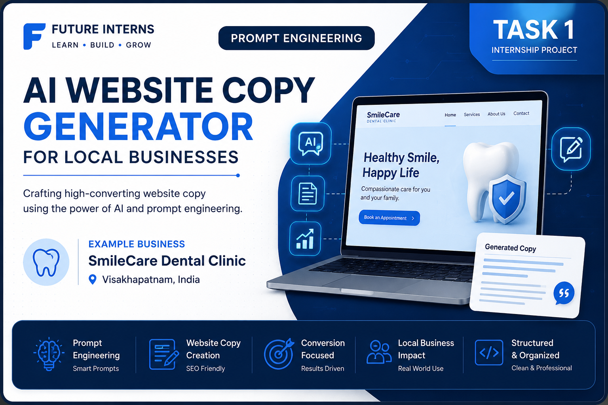

# AI Website Copy Generator for Local Businesses

## 📑 Table of Contents

- [Project Overview](#project-overview)
- [Business Chosen](#business-chosen)
- [Files Included](#files-included)
- [Skills Demonstrated](#skills-demonstrated)
- [Tools Used](#tools-used)
- [What I Learned](#what-i-learned)

## Project Overview

This project demonstrates the use of Prompt Engineering to generate professional website content for a fictional local business using AI.

For this project, I selected **SmileCare Dental Clinic**, located in **Visakhapatnam (Vizag), Andhra Pradesh, India**.

The goal was to create clear, engaging, and SEO-friendly website content using well-structured AI prompts.

---

## Files Included

- prompts.md – Prompt engineering documentation
- homepage.md – Homepage website content
- services.md – Dental services page
- cta.md – Call-to-action content

---

## Skills Demonstrated

- Prompt Engineering
- AI Content Generation
- Website Copywriting
- SEO Content Writing
- Markdown Documentation

---

## Tools Used

- ChatGPT
- Visual Studio Code
- GitHub

---

## What I Learned

Through this project, I learned how to design effective AI prompts, create structured website content, and organize a professional documentation project using Markdown and GitHub.

## 🖼️ Homepage Preview

*Preview of the AI-generated homepage for SmileCare Dental Clinic.*
